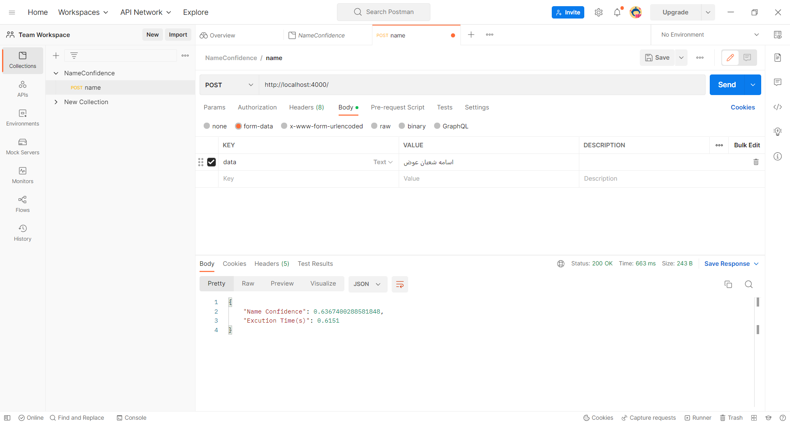

# How to build the docker image
- Open CMD from the directory of ```"digified_project"``` folder.
- Use this command for building an image :  ```" docker build -t api_image . "```
- Use this command for launching the docker container from ```docker-compose.yml``` file :
 ```" docker-compose up "```
- To check running containers : open DOCKER-DESKTOP then open CONTAINERS tab or use this command line:   ```"docker ps"``` 


# How to test the model
- Open ```Postman```
- Create ```POST``` request 
    - Set URL : ```http://localhost:4000/```
    - Select: ```Body -> form-data```
    - Insert: Key = ```data```,  Value = ```"The name to be tested"```
    - Press ```Send```
    
    -  

# How to verify the result you claim
- In directory images I attached some pictures of results from the same model some from the API and others from the Jupyter copy and the model gives the same answers range for real and fake names. 
- I found that the suitable threshold to define if the name is real is : (score >= 0.6)
# Model GRU Architecture
-  

# Model Results from Jupyter
-  

# HTTP API GET REQUEST 
-  

